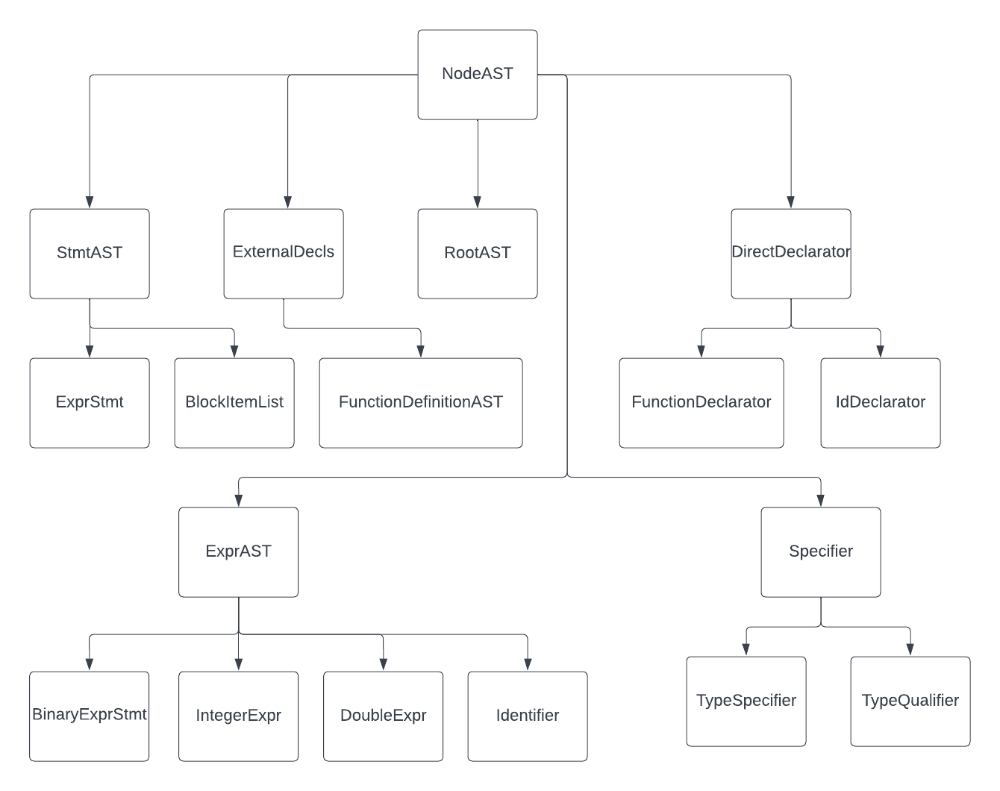

# cc
C compiler

The C language grammar (c.y and c.l files) have been taken from:

http://www.quut.com/c/ANSI-C-grammar-y-2011.html

## Subtyping Relation in AstNodes
The image below shows the subtyping relationship between all the classes created for generating our AST.

### BlockItemListAST
This class corresponds to a compound statement. We Store a vector of type `StmtAST*` each of which correspond to a statement.
A statement can be an expression or a declaration.

### DirectDeclaratorAST
The declarator non-terminal has many productions - but, for our purposes, it is used for producing names of varaibles or functions.
In the case of functions it also produces a list of its parameters. 

### ParamListAST
This class stores a vector of `ParamDeclAST*` objects each of which correspond to a function parameter.

### Specifier
Produces the type specifer among other things. We have a derived class for different kinds. 
`PrimitiveTypeSpecAST`, for example, is used to specify the primitive types like `int`, `char` etc.

### ExprAST
This class is a base class for holding different kinds of expressions.

