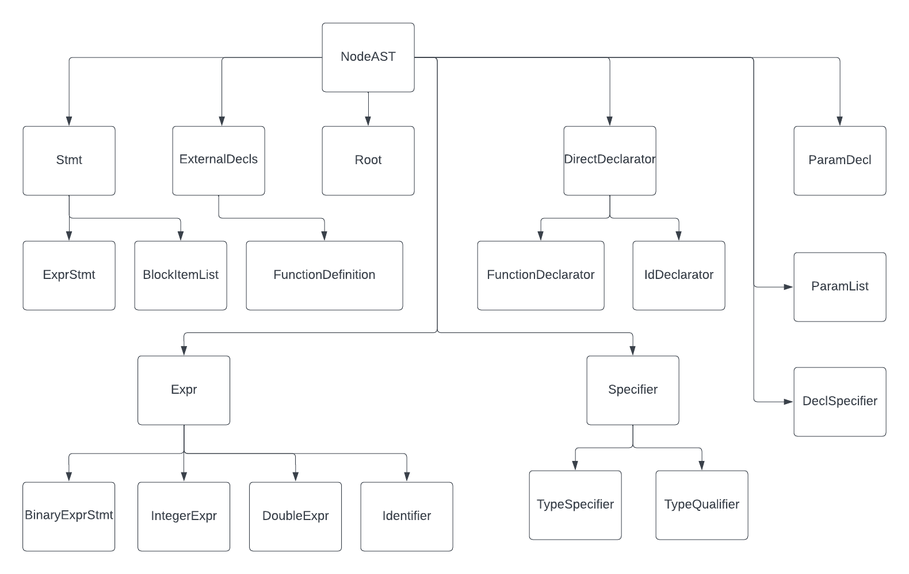

# cc
C compiler

The C language grammar (c.y and c.l files) have been taken from:

http://www.quut.com/c/ANSI-C-grammar-y-2011.html

## Subtyping Relation in AstNodes
The image below shows the subtyping relationship between all the classes created for generating our AST.

### BlockItemListAST
This class corresponds to a compound statement. We Store a vector of type `StmtAST*` each of which correspond to a statement.
A statement can be an expression or a declaration.

### DirectDeclaratorAST
The declarator non-terminal has many productions - but, for our purposes, it is used for producing names of varaibles or functions.
In the case of functions it also produces a list of its parameters. 

### ParamListAST
This class stores a vector of `ParamDeclAST*` objects each of which correspond to a function parameter.

### DeclSpecifierAST
These are the nodes of a linked list. Each of them holds a `Specifier*`.

### Why a linked list for declaration\_specifiers and a vector for block\_item\_list ?

The production rule for declaration\_specifiers produces the current specifier first and then recursively
produces the remaining decl specifiers. Thus, to maintain the order we have to append the current specifier
before the remaining list. 

In the case of block\_item\_list the order is maintained if we append the current statement after the 
list.

### Specifier
Produces the type specifer among other things. We have a derived class for different kinds. 
`PrimitiveTypeSpecAST`, for example, is used to specify the primitive types like `int`, `char` etc.

### ExprAST
This class is a base class for holding different kinds of expressions.

